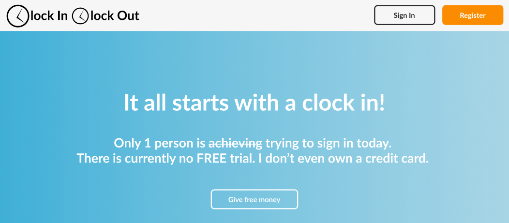
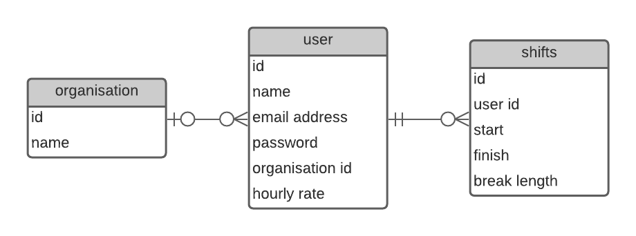

# ClockInClockOut
An application that tracks employee work hours  
  
  
  
  
  
  

Plan of Attack

### Prototype: 
Made in Figma  

### Entity Relationship Diagram  
Made in LucidChart  
Not useful for a Document DB, but I like it. 

Understanding Folder Structure

src - contains all frontend everything.  
__tests__ - contains all test files   
assets - contains all assets   
components - contains all presentational/stateless components   
containers - contains all stateful components   
styles - contains a global CSS config.   

Learned along the way

Only a lot so far. 
dotenv files for secure credentials
MondoDB Atlas and Compass are both the same for viewing db data. 
router.get('/', (req,res)) vs router.route("/").get((req, res)
Todo tree from the marketplace
The precision of capitalisation of db fields. 

